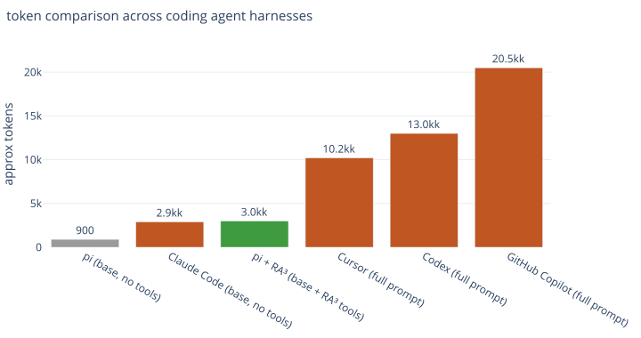

# RA³: Retrieval-Augmented Academic Agent

Ask questions of your books and papers and get answers grounded in the text, with page
citations, that you can verify yourself.

## What it does

RA³ turns your PDFs into a private, searchable knowledge base that your agent cites instead of
guessing. Built for researchers who need answers that trace to specific passages, not
plausible-sounding prose.

- **Cited, verifiable answers.** Every claim is backed by a retrieved passage and cited as
  `(source, page)`, so you can flip to the page and check it.
- **Exact math.** `OCR_MODE=always` (default) routes every PDF through Marker 2 / Surya 2, so
  equations are indexed as real LaTeX (`$$\mathbf{H}[\phi] = \begin{bmatrix}…\end{bmatrix}$$`), not
  mangled glyphs.
- **Your KB stays local.** One SQLite file on your machine; the only data that leaves it is what
  you choose to send to your own OCR/embedding servers (see `server/`).
- **A complete research loop.** Discover papers (Semantic Scholar, citation traversal, open-access
  PDF resolution), read them (text extraction; OCR for scanned PDFs), index them, and query the result.
- **An evolving knowledge base.** Everything you index: including the papers a deep-research run
  reads: accumulates permanently in one SQLite file, so your library compounds with each session
  and stays searchable later.
- **Survives outages and multiple sessions.** The indexing queue is SQLite-backed and
  transactional: any number of pi sessions can queue jobs, each runs exactly once, and VPN/tunnel
  storms make jobs *wait* (or retry with backoff) instead of failing.
- **Fire-and-forget batch indexing.** `document_submit` uploads a pile of PDFs to your OCR server
  as one async job; the server runs OCR + chunking + embedding and builds KB entries while your
  PC is off — `document_pull` merges them when you're back.
- **Retrieval you can rely on.** Zero-shot SciFact nDCG@10 of 0.70: on par with SPLADE, ahead of
  ColBERT and Contriever, so the passages it cites are the right ones.
- **Bring your own model.** RA³ does retrieval; pair it with whichever LLM you run (local or
  hosted). No vendor lock-in.

## How it works

Retrieval fuses three complementary signals: BGE-M3 dense embeddings, BM25 keyword match, and
BGE-M3 learned-sparse weights: via reciprocal-rank fusion and a diversity reranking pass, stored
in one SQLite file (`sqlite-vec`). Indexing runs on a **storm-proof, multi-process queue**
(SQLite + transactional claims: any pi session can enqueue, each job runs exactly once; a health
gate waits out outages, failures retry with backoff, and an OCR checkpoint makes retries cheap).
OCR (`OCR_MODE=always` by default) goes through a pluggable server — Marker 2 / Surya 2 for exact
LaTeX math, Tesseract for plain text — via **async jobs** (`POST /jobs` + polling, so a flaky
tunnel can't kill a long OCR run). The same server can run the whole pipeline remotely
(OCR → chunk → embed → KB bundles) for fire-and-forget batch indexing (`document_submit` /
`document_pull`). The only out-of-process compute is an embedding server you run yourself: CPU or
GPU, or rented: see `server/`.

## Scaling the KB

Dense retrieval degrades as the corpus grows — faster than sparse retrieval does. Reimers &
Gurevych (ACL 2021, arXiv:2012.14210) show that DPR-class dense models beat BM25 from ~10k up to
~1M index entries but lose at 8.8M (MS MARCO scale); the mechanism is distance/cosine
concentration in high-dimensional space (more "accidentally close" vectors crowd out the true
neighbor). RA³ mitigates this with BGE-M3 (trained/evaluated on MS MARCO's 8.8M passages) and
hybrid fusion (dense + BM25 + learned-sparse via RRF), which pushes the accuracy danger zone out
to roughly 1–2M chunks.

The binding constraint for the current stack is therefore **not accuracy but latency**:
`sqlite-vec` vec0 performs an *exact* (brute-force) scan — zero ANN recall loss, but O(N) per
query on top of the embedding-server round-trip. In practice expect the **~500k–1M chunk tipping
point**: beyond it, query latency (not wrong answers) is what you notice first.

Mitigations as the KB grows: raise `k`, add a reranking stage (e.g. `bge-reranker-v2-m3`), use
per-doc `docs=` filters for cross-domain queries, and only if you exceed ~1M chunks, move the
dense leg to an indexed ANN (HNSW/IVF) — accepting a recall-vs-speed trade while keeping hybrid.
The reranker runs on the user's machine, so pick one that is **fast locally**: a cross-encoder on
CPU is fine for a few hundred candidates, but at larger candidate sets its latency can easily
exceed the vector-search time and dominate the query path (see `server/` for GPU-hosted options).

## A small addition to pi

RA³ is not a fork or rewrite of pi: it's a focused set of **open-source contributions on top of
pi**, in the spirit of pi's minimal design. It adds **12 tools, 2 skills, and one policy file**,
measured at **≈3.2k tokens** of system-prompt delta:

[](docs/system-prompt-footprint.html)

- **Measured** (`scripts/prompt-footprint.mjs`): 12 tools ≈1.2k + 2 skills + policy ≈2.0k = **≈3.2k tokens**.
- **Deliberately absent**: no sub-agent swarm, no vendored LLM stack, no instruction wall.

### Token counts: sources (full prompt = prompt text + tool definitions)

| agent | approx. tokens | source |
|---|---|---|
| pi (full) | ~2.5k | base + built-in tools (est.): `@earendil-works/pi-coding-agent` dist |
| pi + RA³ (full) | ~5.7k | measured: pi full + RA³ delta ~3.2k (`scripts/prompt-footprint.mjs`) |
| Cursor | ~10.2k | [WeighMyPrompt](https://weighmyprompt.com/system-prompts/cursor) |
| Codex | ~13k | [openai/codex issue](https://github.com/openai/codex/issues/19212) |
| Claude Code | ~18k | ~2.5k prompt + 14–17k tools: [claudecodecamp](https://www.claudecodecamp.com/p/inside-claude-code-s-system-prompt) |
| GitHub Copilot CLI | ~20.5k | [copilot-cli issue](https://github.com/github/copilot-cli/issues/2627) |

All figures are approximations and vary by version/configuration; the non-RA³ numbers are quoted
from the cited public sources. pi's built-in tool count is estimated.

## The custom prompt (re-framing pi)

Out of the box, pi opens with *"You are an expert coding assistant…"*. RA³ rewrites that opening
(via pi's `before_agent_start` hook) to:

> You are RA³, an academic research assistant operating inside pi. You help researchers search,
> read, cite, and synthesize scholarly books and papers. Ground every answer in retrieved sources,
> cited by page. You write code only as a means to that end.

**Why:** RA³ is a research tool, not a software-engineering tool. The re-frame keeps the agent's
behavior pointed at literature work: retrieve → cite → synthesize, instead of code generation.
It's a ~40-token override of pi's role line, not a rewrite of pi's prompt.

## Install

### 1. Install pi (the agent)

```bash
npm install -g --ignore-scripts @earendil-works/pi-coding-agent
# or: curl -fsSL https://pi.dev/install.sh | sh
```

(Needs Node.js 22.5+: the knowledge base uses `node:sqlite`.)

### 2. Add a model

RA³ does retrieval; pi does the reasoning. Free options first:

| option | cost | how |
|---|---|---|
| **Ollama** (local) | free | `ollama serve`, `ollama pull <model>`, then add the provider to `~/.pi/agent/models.json` (below) |
| **LM Studio** (local) | free | start LM Studio's local server, add it as a provider in `models.json` |
| **Google AI Studio** (Gemini) | free tier | grab a `GEMINI_API_KEY`, add the `google-generative-ai` provider |
| any API (OpenAI / Anthropic / DeepSeek / …) | pay-per-token | save the key with `/login`, pick the model with `/model` |

Local example: add to `~/.pi/agent/models.json`:

```json
{
  "providers": {
    "ollama": {
      "baseUrl": "http://localhost:11434/v1",
      "api": "openai-completions",
      "apiKey": "ollama",
      "models": [
        { "id": "llama3.1:8b", "name": "Llama 3.1 8B (local)" }
      ]
    }
  }
}
```

The file reloads each time you open `/model`: no restart needed. (`apiKey` is a placeholder Ollama ignores.)

### 3. Recommended extras

```bash
pi install npm:pi-web-access    # web browser access for the agent
pi install npm:pi-zentui        # ZentUI components
```

### 4. Install RA³: pi does the rest

```bash
pi install git:github.com/DominikJur/ra3
```

That one command clones the package, installs all runtime dependencies (pdfjs, sqlite-vec,
canvas) automatically, and registers the tools + skills: no manual `npm install`.

### 5. Point embedding at a server (the only extra step)

```bash
export EMBED_BASE_URL=http://localhost:8001
```

> **One embedding manifold, one build.** The dense vectors in `kb.sqlite` were produced by
> FlagEmbedding BGE-M3 (fp16). The query embedder must be the **same build**: a different
> BGE-M3 build (Xenova/bge-m3 q8, ollama bge-m3, …) is a different embedding manifold, so its
> cosine scores against the stored vectors are meaningless. There is **no** silent local vector
> fallback: if the embed server is unreachable, search degrades honestly to keyword-only (BM25),
> and indexing fails. Stand up the server first (`server/embed/embed-server.py`: see
> `server/README.md`).
> **No GPU?** It runs on CPU (same build, slower), or deploy the bundled Docker image to a rented
> GPU box (RunPod/Vast/Lambda/…) and point `EMBED_BASE_URL` at it: the server is just a URL.

## Quickstart

```
document_index({ source: "path/to/book.pdf" })      # index a PDF (local/URL/DOI): queues in the background
document_search({ query: "bias variance tradeoff" }) # hybrid search, cites (source, page)
document_page({ doc: "slug", page: 307 })            # full page text (exact equations)
document_status()                                    # indexed docs + background queue progress
```

`document_index` is **asynchronous**: it queues the job and returns immediately, so you can index
several documents at once and keep working: indexing (and OCR) run in the background and a
notification fires when each job finishes. The queue is shared across pi sessions (SQLite,
exactly-once claims) and resilient to outages: when the embed/OCR servers are unreachable, jobs
*wait* instead of failing.

**Fire-and-forget batch indexing (close the PC):**

```
document_submit({ sources: ["a.pdf", "b.pdf", "book.pdf"] })  # one async job; your OCR server runs OCR+chunk+embed
# ... the server keeps working while your machine is off ...
document_pull()                                                # merge finished KB entries (download + import)
```

CLI equivalent: `node remote-jobs.mjs <submit|status|pull>`.

OCR: `OCR_MODE=always` (default) routes every PDF through the OCR server at `OCR_BASE_URL`; set
`OCR_MODE=auto` (scanned only) or `off` to change. Two interchangeable servers ship in
`server/`; point `OCR_BASE_URL` at whichever you run:

```bash
# light (recommended without a GPU): Tesseract: plain text only, no math/table fidelity
#   docker build -t ra3-ocr-light server/ocr-light && docker run -p 8002:8002 ra3-ocr-light
export OCR_BASE_URL=http://localhost:8002

# recommended (GPU): Marker 2 / Surya 2: exact LaTeX math on every page (--force_ocr)
#   see server/ocr/README.md (vLLM inference backend, no docker needed)
export OCR_BASE_URL=http://localhost:8002
```

See `server/README.md` for the full comparison and the documented weaknesses of each.
(**Vulnerability TL;DR:** the light server OCRs plain text well but mangles math, tables, and
multi-column reading order: equations become garbage. Use Marker 2 if those matter.)

## Import / export the knowledge base

The whole KB is one portable SQLite file, so it can be backed up or moved between machines.

**Tools** (recommended, run inside pi):

```
document_export_kb({ dest: "path/to/kb-export.sqlite" })    # lossless snapshot (docs+chunks+dense+sparse)
document_import_kb({ source: "path/to/kb-export.sqlite" })   # merge (skip existing) or replace:true
```

**CLI** (without pi):

```bash
node export-kb.mjs kb-export.sqlite[.gz] [--gzip]   # ~2 s for a 77-doc KB
node import-kb.mjs kb-export.sqlite[.gz] [--replace]
```

Notes:

- Export is a byte-exact snapshot (the WAL is folded first): vectors are copied **verbatim**, so
  importing needs **no re-embedding** and **no GPU**.
- Import **merges by default** (slugs already present are skipped); `replace:true` overwrites them.
  A full-KB merge import is I/O-bound by sqlite-vec's per-row insert (~6 ms/vector-row on a laptop);
  a few docs import in seconds.
- **Fast restore** (no merge): quit pi, copy the snapshot over `kb.sqlite`, relaunch.
- A `.gz` extension (or `--gzip`) compresses the snapshot; import auto-detects it.

## Configuration (all via env)

| var | default | meaning |
|---|---|---|
| `EMBED_BASE_URL` | `http://localhost:8001` | BGE-M3 dense+sparse embed server |
| `OCR_BASE_URL` | `http://localhost:8002` | OCR server (recommended: Marker 2 `server/ocr/`; light: Tesseract `server/ocr-light/`) |
| `OCR_MODE` | `always` | when OCR runs: `always` (every doc, exact math) · `auto` (scanned only) · `off` |
| `KB_ROOT` | `~/pi_research/books` | where `kb.sqlite` + per-doc dirs live |
| `S2_API_KEY` |: | Semantic Scholar API key (avoids rate limits) |
| `UNPAYWALL_EMAIL` |: | email for the Unpaywall API |

## Retrieval benchmark: SciFact (zero-shot)

300 test queries, retrieval-only (no LLM):

| Leg | nDCG@10 | Recall@100 |
|---|---|---|
| dense only | 0.6415 | 0.9037 |
| BM25 only | 0.6621 | 0.8792 |
| sparse only | 0.6340 | 0.9002 |
| **3-leg (RRF)** | **0.7011** | **0.9477** |

Ties SPLADE (0.706) and beats ColBERT / Contriever on SciFact: with single-vector-per-chunk
storage. Run it yourself: `python scifact_eval/eval.py` (embeds via `EMBED_BASE_URL`, caches
corpus vectors). See `scifact_eval/README.md`.

## Demo

<video src="docs/demo.mp4" controls width="100%"></video>

*(4× speed; pi on the left in Windows Terminal (Git Bash), VSCodium on the right with the zentui theme.)*

The full loop: index a book, retrieve, answer with page citations. Corpus: *Finite Difference
Computing with PDEs* (Langtangen & Linge, CC BY 4.0; `./fetch-corpus.sh` downloads it). The question
and its grounded answer live in `demo/README.md` and `demo/answer.md`.

[Open the video directly](docs/demo.mp4) if the inline player doesn't load.

## Layout

- `extensions/deep-research/`: the tools (`document_index/search/page/status/export_kb/import_kb`,
  `document_submit/pull`, `academic_graph_search`, `academic_citations`, `unpaywall_resolver`,
  `pdf_extract`). `lib/kb-sqlite.ts` is the KB engine, `lib/queue.ts` the multi-process SQLite
  queue, `lib/remote-jobs.ts` the submit/pull client.
- `export-kb.mjs` / `import-kb.mjs`: standalone CLI wrappers for KB snapshot/merge.
- `remote-jobs.mjs`: remote batch CLI (`submit` / `status` / `pull`).
- `kb-state.mjs`: KB viewer — `node kb-state.mjs` lists every document with its real title,
  embedding model, OCR method and sizes; `node kb-state.mjs <index|slug>` shows full metadata
  (source, chunk spread, sections, provenance).
- `server/`: reference compute servers: `embed/` (FlagEmbedding BGE-M3), `ocr/` (Marker 2 / Surya 2),
  `ocr-light/` (Tesseract). See `server/README.md`.
- `skills/book/` + `skills/deep-research/`: the workflow instructions.
- `scifact_eval/`: retrieval-only benchmark harness.
- `demo/`: the demo corpus question + retrieval script.
- `AGENTS.md`: the RAG-first (anti-hallucination) policy.

## Credits & citations

Everything this package builds on is cited here.

**Retrieval & embeddings**

- **BGE-M3**: Jianlv Chen, Shitao Xiao, Peitian Zhang, Kun Luo, Defu Lian, Zheng Liu.
  *“M3-Embedding: Multi-Linguality, Multi-Functionality, Multi-Granularity Text Embeddings
  Through Self-Knowledge Distillation.”* Findings of the Association for Computational
  Linguistics: ACL 2024. arXiv:2402.03216, DOI 10.18653/v1/2024.findings-acl.137.
  Model `BAAI/bge-m3` (MIT); served via [FlagEmbedding](https://github.com/FlagOpen/FlagEmbedding) (MIT).
- **BM25**: S. E. Robertson & S. Walker (1994), *“Some Simple Effective Approximations to the
  2-Poisson Model for Probabilistic Weighted Retrieval,”* SIGIR; and S. Robertson & H. Zaragoza
  (2009), *“The Probabilistic Relevance Framework: BM25 and Beyond,”* Foundations and Trends in
  Information Retrieval 3(4).
- **Reciprocal Rank Fusion**: G. V. Cormack, C. L. A. Clarke, S. Büttcher (2009),
  *“Reciprocal Rank Fusion Outperforms Condorcet and Individual Rank Learning Methods,”* SIGIR.
- **Maximal Marginal Relevance**: J. Carbonell & J. Goldstein (1998), *“The Use of MMR,
  Diversity-Based Reranking for Reordering Documents and Producing Summaries,”* SIGIR.

**OCR**

- **Marker 2 / Surya 2**: Datalab (2025), *“Marker 2”* / *“Surya 2”* — the OCR server in
  `server/ocr/`. Code Apache-2.0; **model weights OpenRAIL-M** (free for research / personal /
  startups < $5M revenue; commercial above needs a paid datalab.to license).
- **Tesseract**: Ray Smith (2007), *“An Overview of the Tesseract OCR Engine,”* Proc. 9th
  Int. Conf. on Document Analysis and Recognition (ICDAR), pp. 629–633. Apache-2.0.

**Libraries & infrastructure**

- **pi**: the coding agent this package extends: [`@earendil-works/pi-coding-agent`](https://www.npmjs.com/package/@earendil-works/pi-coding-agent).
- **sqlite-vec**: Alex Garcia ([asg017/sqlite-vec](https://github.com/asg017/sqlite-vec)), MIT / Apache-2.0.
- **pdf.js**: Mozilla ([pdfjs-dist](https://github.com/mozilla/pdf.js)), Apache-2.0.
- **@napi-rs/canvas**: PDF page rendering to PNG (MIT).
- **Semantic Scholar API**, **Crossref**, **Unpaywall**: academic metadata and open-access PDF
  resolution for the deep-research tools.

**Benchmark & demo corpus**

- **SciFact**: David Wadden, Shanchuan Lin, Kyle Lo, Lucy Lu Wang, Madeleine van Zuylen,
  Arman Cohan, Hannaneh Hajishirzi. *“Fact or Fiction: Verifying Scientific Claims.”* EMNLP 2020,
  arXiv:2004.14974. (Retrieval benchmark, used via BEIR.)
- **Demo corpus**: Hans Petter Langtangen & Svein Linge, *“Finite Difference Computing with
  PDEs,”* Springer 2017, CC BY 4.0 (downloaded by `fetch-corpus.sh`, not bundled).

## Future directions

Today retrieval is *flat*: it ranks chunks by vector + keyword similarity. The roadmap is
**graph-RAG**: a knowledge graph built over your corpus, so a query can follow *relations*
(entities, concepts, citations, "what builds on what") rather than only matching passages.

- **A local-LLM generated knowledge graph.** Entities and relations are extracted by an LLM on
  your own machine: nothing leaves it, and stored alongside the embeddings, so one corpus serves
  both flat retrieval and graph traversal.
- **The open problem: extracting meaningful relations from books in a timely manner.** Books are
  long, dense, and cross-referential; naïvely prompting an LLM for relations is too slow and too
  costly at library scale. Finding a way to extract relations that are actually *meaningful*, not
  noisy: within a practical time and cost budget is the active research focus, and the biggest
  lever for retrieval quality.

If you want to help push this forward: relation extraction over books, graph construction, or
graph-RAG retrieval: please open an issue on this repository.

## License

Apache-2.0. (The demo corpus is CC BY 4.0 and is *not* bundled: `fetch-corpus.sh` downloads it.)
