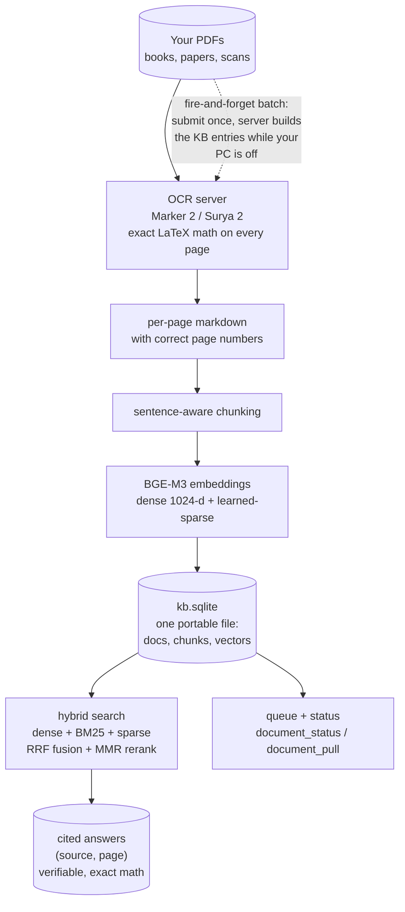

# How it works

Top to bottom: your PDFs become cited, verifiable answers with exact math. All the heavy
compute (OCR, embeddings) happens on **your own server**; the knowledge base stays one portable
SQLite file on your machine. Indexing is a background queue that survives outages and multiple
sessions, and the fire-and-forget path lets the server build the KB entries while your laptop is
off.
